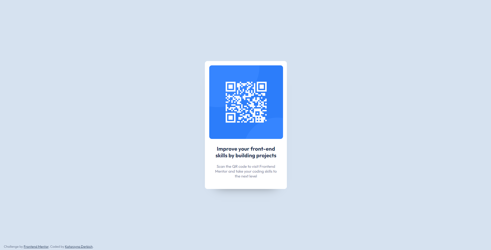

# Frontend Mentor - QR code component solution

This is a solution to the [QR code component challenge on Frontend Mentor](https://www.frontendmentor.io/challenges/qr-code-component-iux_sIO_H). Frontend Mentor challenges help you improve your coding skills by building realistic projects.

## Table of contents

- [Overview](#overview)
  - [The challenge](#the-challenge)
  - [Screenshot](#screenshot)
  - [Links](#links)
- [My process](#my-process)
  - [Built with](#built-with)
  - [What I learned](#what-i-learned)
- [Author](#author)

## Overview

### The challenge

Users should be able to:

- Display the QR card correctly on both the computer and the mobile device

### Screenshot

- Mobile Solution (375px width):

  

- Desktop Solution (1920px width):

  

### Links

- Solution URL: [GitHub Sollution](https://github.com/belie369/frontend-mentor-qr-code)
- Live Site URL: [GitHub Live](https://belie369.github.io/frontend-mentor-qr-code/)

## My process

### Built with

- Semantic HTML5 markup
- CSS
- SASS SCSS with variables
- BEM methodology
- Flexbox
- Mobile-first workflow

### What I learned

- Build a website based on one CSS file that looks good on both your computer and mobile device.

## Author

- Website - [katarzynaderbich.pl](http://katarzynaderbich.pl/)
- Frontend Mentor - [@belie369](https://www.frontendmentor.io/profile/belie369)
- Twitter - [@belie369](https://www.twitter.com/belie369)
